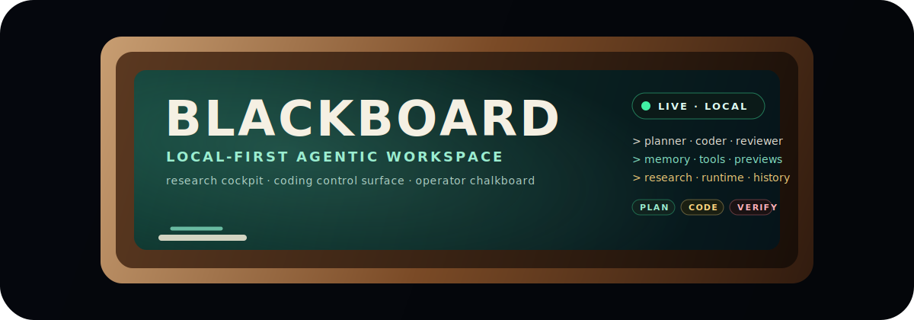

<p align="center">
  
</p>

<p align="center">
  <strong>A local-first, provider-routed agentic coding workspace built like an operator chalkboard for coding, orchestration, research, and runtime control.</strong>
</p>

<p align="center">
  <em>Young, aggressive, and architecture-heavy: Blackboard is the earliest public shape of a much bigger control surface.</em>
</p>

<p align="center">
  
  
  
</p>

<p align="center">
  
  
  
  
</p>

---

## What is Blackboard?

Blackboard is a local-first coding command center built around one rule:

> **The workspace owns the project. Providers only supply intelligence or execution.**

> **Blackboard is effectively the author's accumulated research, experiments, and operator workflows compiled into one app.**

It combines a FastAPI backend, vanilla JavaScript UI, provider routing, local project state, coding jobs, terminals, previews, audit logs, and git-backed history into one operator-facing workspace.

Blackboard can route work across roles like `planner`, `coder`, `reviewer`, `debugger`, `summarizer`, `local_helper`, and `presenter`, while keeping state and mutation control local.

It also acts as a practical research/control surface for **proto-AGI-style orchestration experiments** and for **partial WebGPU OS / browser-runtime integration work** derived from the broader Luna and Particle/engine ecosystem around it. In practice, that means Blackboard is not just a coding board or chat shell: it is also one of the local operator environments used to explore orchestration, research loops, memory, browser tooling, preview/runtime control, and adjacent OS-like interface ideas.

## Why it feels different

Blackboard did not start as a generic SaaS-style productivity tool. It started on **Thursday, May 14, 2026** as a way to consolidate research, orchestration patterns, local operator tooling, coding workflows, UI experiments, and runtime-control ideas into a single app.

That also means the project is **very young**. Some surfaces are still early, some integrations are still partial, and some paths are more proven than others.

The current public state of Blackboard still represents only **roughly 30% of the author's broader research, experiments, and system design work**. A large amount of the deeper research, operator workflows, orchestration logic, and longer-horizon integration work is still being folded in over time.

Because of that, Blackboard should be treated as a fast-moving system with ongoing **weekly or bi-weekly updates**, plus continuous improvements, fixes, patches, and research roll-ins as more of the larger body of work gets integrated into the app.

But the intent is not small.

Blackboard is being shaped as a serious local-first control surface with the long-term ambition to **challenge major competitors** in agentic coding, orchestration, and operator tooling by combining research depth, local control, and rapid iteration in one place.

## Project profile

| Aspect | Current framing |
|---|---|
| **Age** | Development started Thursday, May 14, 2026 |
| **Stage** | Very early / rapidly evolving |
| **Update cadence** | Weekly or bi-weekly updates, plus ongoing improvements and patches |
| **Core identity** | Local-first operator chalkboard for coding and orchestration |
| **Research origin** | Effectively a compilation of the author's research, experiments, and workflows into one app |
| **Research coverage in current public build** | Roughly 30% of the broader research has been folded in so far |
| **Long-term ambition** | Grow into a system capable of competing with major incumbents in this space |

## Current test status

**Important:** this project has only been actively tested end-to-end with the **Fireworks API** so far.

Other provider paths exist and are wired, but should be treated as integration targets until you verify them in your environment. The Blackboard UI is plain browser JavaScript and currently has no Node/npm test or build pipeline.

| Provider / executor | Status | Notes |
|---|---:|---|
| Fireworks AI OpenAI-compatible API | Tested | Primary tested API path and fallback target. Use `FIREWORKS_API_KEY`. |
| OpenAI API | Wired, partially tested | Uses `OPENAI_API_KEY`; provider fallback on quota/rate-limit errors is covered by regression tests. |
| Anthropic API | Wired, not fully tested | Uses `ANTHROPIC_API_KEY`. |
| Local OpenAI-compatible server | Experimental | Default local profile points at `http://127.0.0.1:8012/v1`. |
| Claude Code CLI | Optional / external | Requires installed and authenticated `claude` CLI. |
| OpenAI Codex CLI | Optional / external | Requires installed and authenticated `codex` CLI. |

## Highlights

- **Provider management:** Settings shows every configured provider, including offline or missing-key providers, so keys/models can be changed in place.
- **Model and order controls:** provider state is live-synced; the user can change model choice, keys, and role priority.
- **Role routing:** planner/coder/reviewer/debugger-style role chains with automatic usable-provider syncing.
- **Adaptive skill synthesis:** Blackboard now auto-builds composable project-local `SKILL.md` files from user history, current task intent, board state, and project intelligence, then refreshes them on each chat loop.
- **Streaming chat:** SSE chat streaming with fallback to standard completion.
- **Chat image attachments:** assistant replies can persist inline images, and tools/providers can explicitly register base64, data URL, or local image files through a dedicated chat attachment API.
- **Agentic coding jobs:** ReAct loop, tool registry, worktree isolation, file claims, verification, and explicit merge flow.
- **Human review gate:** successful coding jobs stop in `reviewing`; cards only move to `done` when a human explicitly finishes them from the review lane.
- **Configurable coding concurrency:** `coding.max_concurrent` controls maximum concurrent coding jobs and can be persisted from Settings.
- **Portable code search:** `search_code`, `search_files`, and `search_multi` prefer `ripgrep` for fast text search and automatically fall back to the built-in Python scanner when `rg` is not installed.
- **Research modules:** Blackboard now exposes Luna-style `fetch_url`, `web_search`, `web_news`, and `web_research` tools, plus custom wiki research/ingest/query tools and Playwright screenshot support.
- **Proto-AGI research surfaces:** Blackboard includes research-oriented orchestration, verification, memory, adaptive-skill, and tool-loop surfaces that are useful for experimenting with proto-AGI behavior in a local operator-controlled environment.
- **Partial WebGPU OS integration lineage:** Blackboard incorporates selected browser-runtime, preview, ambience, and OS-like interface ideas informed by Luna and the Particle Engine WebOS / engine-side ecosystem, while remaining a coding workspace rather than a full WebGPU OS runtime.
- **Local project board:** Trello-style cards with status, files, constraints, verification notes, and launch actions.
- **Execution layer:** terminal sessions, preview server runner, and screenshot support.
- **Mobile shell hardening:** a late-loaded mobile stylesheet keeps the phone UI from stacking desktop panels or exposing raw fallback controls.
- **Versioning:** git-backed `data/` timeline with checkpoints, diffs, tags, and rollback.
- **Audit logs:** per-project JSONL audit trail with secret redaction.
- **No frontend build step:** the UI is plain ES modules served from `ui/`.

## Requirements

### Required

| Requirement | Why |
|---|---|
| Python 3.12+ | Backend runtime. Python 3.12 is the current development/test environment. |
| `pip` + virtualenv | Dependency installation and isolation. |
| Git | Version history, checkpoints, rollback, and worktree-based coding jobs. |
| At least one provider API key | Fireworks is the primary tested path; OpenAI/Anthropic are configurable provider targets. |

### Optional but useful

| Optional requirement | Enables |
|---|---|
| `ripgrep` (`rg`) | Preferred backend for Blackboard's code-search tools. Faster file discovery and text search than the pure Python fallback. |
| `crawl4ai` | Preferred extraction backend for Blackboard's web research tools (`fetch_url`, `web_research`). |
| Node.js + npm/npx | Optional project preview runners for external Vite/Next/npm apps only; not required for Blackboard UI and not part of the current test workflow. |
| Playwright browsers | Optional screenshot capture and browser tooling. |
| `pywinpty` on Windows | Optional better terminal behavior; the app falls back to subprocess pipes when it is absent. |
| Claude Code CLI | `claude-code` coding provider. |
| OpenAI Codex CLI | `openai-codex-cli` coding provider. |
| Local OpenAI-compatible server | `llama-local` / local helper profile. |

Install Playwright browsers if you want screenshot support:

```bash
python -m playwright install chromium
```

Install `ripgrep` if you want the fastest search behavior from Blackboard's coding tools:

```powershell
winget install BurntSushi.ripgrep.MSVC
```

```bash
brew install ripgrep
```

```bash
sudo apt-get install ripgrep
```

Install `crawl4ai` if you want the preferred web-research extraction backend used by Blackboard's research tools:

```bash
pip install crawl4ai
```

## Quick start

### Windows / PowerShell

```powershell
python -m venv .venv
.\.venv\Scripts\Activate.ps1
pip install -r requirements.txt

$env:FIREWORKS_API_KEY = "fw_..."

.\start.bat
```

Open:

```text
http://127.0.0.1:8780/
```

### Standard Python

```bash
python -m venv .venv
source .venv/bin/activate
pip install -r requirements.txt

export FIREWORKS_API_KEY="fw_..."

python -m blackboard.main
```

## Search backends

Blackboard's coding stack now exposes a portable search layer for agent tools:

- `search_code`
- `search_files`
- `search_multi`

Behavior:

- If `ripgrep` (`rg`) is installed and available on `PATH`, Blackboard uses it as the preferred backend for fast text and file search.
- If `rg` is missing or unavailable, Blackboard falls back to the built-in Python scanner automatically.
- `search_multi` runs multiple read-only searches in parallel and merges the discovered paths so the agent can narrow down relevant files faster.

You can run Blackboard without `ripgrep`, but installing it is strongly recommended for larger repositories.

## Coding jobs and review flow

Blackboard's coding lane is intentionally gated.

Behavior:

- Coding jobs run through the `BackgroundJobManager` with worktree isolation, file claims, review, and merge controls.
- The maximum number of active coding jobs is configurable with `coding.max_concurrent` in `config.yaml`.
- Settings can persist a coding override under:

```text
data/server/coding_overrides.json
```

- The default concurrency is `4`, normalized to the supported range `1..32`.
- Detached job runners load the same merged coding configuration as the main app.
- Changing max concurrent jobs in Settings persists immediately, but the already-running job manager reports `restart_required` when its live runtime limit differs from the configured value.
- Successful jobs do **not** auto-finish cards. They move the linked card to `reviewing`.
- Cards can only move to `done` from `reviewing`, which records explicit human approval metadata on the card.
- Merge remains explicit and separate from board completion.

## Adaptive skills

Blackboard's existing `SKILL.md` system now supports an adaptive layer that stays Blackboard-native instead of creating a second memory mechanism.

Behavior:

- On each chat turn, Blackboard synthesizes project-local skills from recent session history, scratchboard facts, board state, message receipts, and project intelligence.
- The synthesized skills are written into `data/projects/<project_id>/adaptive_skills/**/SKILL.md` so they remain compatible with the normal skill index and `skill_invoke` flow.
- Generated skills are composable. The first version includes an adaptive user-profile skill, a current-build skill, a tool-builder skill, and a skill-graph skill that explains composition order.
- Coding runs rebuild the adaptive skill set before constructing the coder skill index, so the coding loop sees adaptive skills as first-class skills alongside static project/global skills.
- When the current request implies missing capability coverage, Blackboard emits tool-building guidance through adaptive skills rather than inventing a parallel tool-planning subsystem.

## Research modules

Blackboard now has multiple research surfaces.

### Web research tools

These are Luna-style web research modules exposed through the ReAct tool registry:

- `fetch_url`
- `web_search`
- `web_news`
- `web_research`
- `search_github`
- `search_stackoverflow`
- `search_documentation`
- `search_tutorials`

Behavior:

- `web_search` and `web_news` use DuckDuckGo HTML result parsing to discover sources.
- `fetch_url` prefers `crawl4ai` extraction, then Playwright, then direct `httpx` fetch + HTML stripping.
- `web_research` searches for sources, then fetches them with `crawl4ai` first and Playwright/browser fallback when needed.
- Search results are filtered through Luna-style ad/tracker blocking and source credibility scoring before ranking.
- Blackboard now uses query-aware Crawl4AI filtering where possible: BM25-style filtering for targeted research queries and pruning-style cleanup for generic extraction.

### Interactive browser research tools

Blackboard now also includes Luna-style interactive browser tools in the ReAct registry:

- `browse`
- `browse_search`
- `browse_inspect`
- `browse_click`
- `browse_type`
- `browse_scroll`
- `browse_read`
- `browse_links`
- `browse_extract`

Behavior:

- These tools use a shared Playwright browser session.
- Browser requests use Luna-style resource blocking for ads, trackers, and unnecessary assets.
- `browse_search` supports multiple browser search engines including DuckDuckGo, Google, Bing, and Brave.

### Playwright debugging tools

Blackboard now also exposes Luna-style browser debugging helpers:

- `site_screenshot`
- `check_console_errors`
- `check_network_errors`
- `eval_js`
- `get_page_html`
- `wait_for_element`
- `check_page_health`

### Custom Blackboard research/debug modules

Blackboard also has project-local research and browser-adjacent modules that are separate from the Luna-style `web_*` and `browse_*` tools:

- `wiki_search`
- `wiki_read`
- `wiki_ingest`
- `wiki_query`
- `wiki_lint`
- preview runner via `/api/preview/{project_id}`
- Playwright screenshot capture via `/api/playwright/screenshot`

What these are for:

- **Wiki tools**: durable project knowledge, ingestion, and question-answering over stored markdown pages.
- **Preview runner**: launch local project servers for app inspection and debugging.
- **Playwright screenshot runner**: custom Blackboard browser capture for visual verification when you already know the target URL.

### Recommended setup

For the best research/tooling experience, install:

- `ripgrep`
- `crawl4ai`
- `playwright`
- Chromium via `python -m playwright install chromium`

Blackboard will still run without these extras, but the research and browser workflows will use reduced fallbacks.

## Chat images and attachments

Blackboard supports chat images through the existing session attachment store:

```text
data/projects/<project_id>/chat_attachments/<session_id>/<message_id>/
```

There are two supported paths:

- Assistant replies can include Markdown image syntax, HTML `` tags, data URLs, or safe local image paths; Blackboard rewrites supported local/data images into served attachment URLs.
- Tools or providers can explicitly register images without smuggling them through reply text.

Explicit registration endpoint:

```text
POST /api/chat/{project_id}/sessions/{session_id}/attachments/{message_id}
```

Example body:

```json
{
  "attachments": [
    {
      "content_base64": "...",
      "content_type": "image/png",
      "filename": "render.png",
      "alt": "Generated render"
    },
    {
      "source": "images/local-result.png",
      "alt": "Local result"
    }
  ]
}
```

The response returns `images` entries with Blackboard-served `src` URLs. Attachment serving uses:

```text
GET /api/chat/{project_id}/sessions/{session_id}/attachments/{message_id}/{filename}
```

For safety, local path registration is restricted to allowed roots such as `data_root` and the selected project root. Remote HTTP(S) image URLs are not fetched by registration; callers should provide a local file, data URL, or base64 payload when they want Blackboard to own the image file.

## Mobile and local-network UI

Blackboard's UI is still the same vanilla ES module app on desktop and phone, but mobile has a dedicated late-loaded stylesheet:

```text
ui/styles/mobile.css
```

The mobile shell is active at `900px` and below, matching the JavaScript mobile breakpoint. It provides:

- a single active panel at a time: chat, board, artifacts, or console
- a bottom mobile navigation bar
- a slide-out mobile drawer for secondary actions
- protected pre-JS defaults so desktop panels do not stack on top of each other while the app boots
- Artifact Studio nested-pane behavior that also activates at the same `900px` breakpoint

When testing from a phone over LAN, use the configured LAN host/port and hard-refresh the mobile browser after CSS changes because mobile Chrome can aggressively cache styles.

## Provider configuration

Main configuration lives in:

```text
config.yaml
```

The default provider section includes Fireworks, OpenAI, Anthropic, CLI executors, and a local OpenAI-compatible profile.

For the tested path, configure Fireworks:

```powershell
$env:FIREWORKS_API_KEY = "fw_..."
```

The default Fireworks profile is:

```yaml
fireworks-fast:
  type: llm_api
  adapter: openai_compat
  endpoint: https://api.fireworks.ai/inference/v1
  api_key_secret: fireworks_main
  model: accounts/fireworks/models/kimi-k2p5
```

Secrets are referenced by `api_key_secret` and resolved from environment variables, inline Settings overrides, or an optional local keyring backend if installed. API keys are not written to project files or audit logs.

Provider model and role overrides are persisted under:

```text
data/providers/
```

Coding settings can also be configured in `config.yaml`:

```yaml
coding:
  max_concurrent: 4
```

Settings writes persisted coding overrides under:

```text
data/server/coding_overrides.json
```

Server access and LAN/remote settings are also managed through Settings and persisted under `data/server/`.

## Project layout

```text
blackboard/
  api/           FastAPI routers
  coding/        jobs, worker, worktrees, reviewer, skills, context
  execution/     terminal, preview runner, Playwright screenshot support
  kernel/        bus, logger, config, prompts, atomic file helpers
  providers/     provider interface, registry, API adapters, CLI adapters
  react/         ReAct loop, scratchpad, tool registry, tools
  workspace/     projects, board, audit, memory, version control, overrides

ui/
  core/          REST client, WebSocket client, bus, store
  shell/         board, sidebar, settings, history, audit, preview, terminal
  styles/        CSS tokens, component styling, mobile shell overrides

data/
  projects/      local project state and audit logs
  providers/     key/model/role overrides
  coding/        job DB and coding state
  server/        server access and coding override settings
```

## API surface

```text
GET  /healthz

GET  /api/providers
GET  /api/providers/health
POST /api/providers/{id}/key
DELETE /api/providers/{id}/key
POST /api/providers/{id}/model
POST /api/providers/{id}/models/refresh

GET  /api/projects
POST /api/projects
POST /api/projects/{id}/switch

GET  /api/board/{project_id}
POST /api/board/{project_id}/cards
PUT  /api/board/{project_id}/cards/{card_id}
DELETE /api/board/{project_id}/cards/{card_id}

GET  /api/settings
GET  /api/settings/access
PUT  /api/settings/access
GET  /api/settings/coding
PUT  /api/settings/coding

POST /api/chat
POST /api/chat/stream
GET  /api/chat/{project_id}/sessions
GET  /api/chat/{project_id}/sessions/{session_id}/history
DELETE /api/chat/{project_id}/sessions/{session_id}
DELETE /api/chat/{project_id}/sessions/{session_id}/history
POST /api/chat/{project_id}/sessions/{session_id}/attachments/{message_id}
GET  /api/chat/{project_id}/sessions/{session_id}/attachments/{message_id}/{filename}
GET  /api/chat/{project_id}/receipts/recent
POST /api/chat/{project_id}/receipts/search

POST /api/coding/jobs
GET  /api/coding/jobs
GET  /api/coding/context
POST /api/coding/jobs/{id}/cancel
POST /api/coding/jobs/{id}/merge

POST /api/preview/{project_id}
GET  /api/preview/{project_id}
DELETE /api/preview/{project_id}

GET  /api/audit/{project_id}

GET  /api/versioning/history
GET  /api/versioning/diff?sha={sha}
POST /api/versioning/checkpoint
POST /api/versioning/rollback
```

## Development

Run tests:

```bash
pytest
```

Focused suites:

```bash
pytest tests/test_providers.py -q
pytest tests/test_role_disable_autofill.py -q
pytest tests/test_phase7.py -q
pytest tests/test_version_control.py -q
pytest tests/test_api.py -q
pytest tests/test_workspace.py::test_board_done_requires_human_review_from_reviewing -q
pytest tests/test_coding_layer.py::test_background_job_success_lifecycle_updates_board_end_to_end -q
pytest tests/test_api.py::test_chat_attachment_registration_api_persists_base64_and_local_images -q
```

Compile-check key backend files:

```bash
python -m py_compile blackboard/providers/registry.py blackboard/execution/preview.py blackboard/api/providers.py blackboard/api/chat.py blackboard/workspace/chat_attachments.py
```

Frontend notes:

- Blackboard's own UI is served directly from `ui/` as vanilla ES modules.
- There is no required Node install, npm install, bundler, or frontend build step for the Blackboard UI.
- Node-based preview runners (`node`, `vite`, `next`) are optional helpers for external projects and are not part of the current validated test path.

## Operational notes

- Runtime state is stored in `data/`.
- `data/` has its own git-backed timeline managed by Blackboard versioning.
- Coding jobs run in isolated worktrees and require explicit confirmation before merge.
- Successful coding jobs stop in `reviewing`; a human must move the card from `reviewing` to `done`.
- Coding max concurrency is configured by `coding.max_concurrent` and persisted Settings overrides.
- Audit logs are project-scoped and secret-redacted.
- Provider model/role/key overrides are persisted outside `config.yaml`.
- Chat image attachments are persisted under each project's `chat_attachments` session tree.
- Preview runners start local subprocesses and should be treated like local dev servers.
- The frontend is served directly; there is no webpack/Vite build step for the Blackboard UI itself.
- Mobile layout is controlled by `ui/styles/mobile.css`, loaded last to override desktop panel stacking on phones.

## Attribution and provenance

Blackboard includes original project code plus code, implementation patterns, UI ideas, and documentation lineage from related local projects.

- **Project Luna:** Blackboard adapts architecture, agent orchestration ideas, provider patterns, streaming/event patterns, tool-loop concepts, and selected implementation approaches from Project Luna.
- **Project Luna research lineage:** Blackboard also reflects Luna's framing as a local-first orchestration environment for autonomous or proto-AGI-oriented research, including lifecycle control, research tooling, observability, verification, memory, and operator-facing runtime surfaces.
- **Particle Engine WebOS / Particle Engine / related engine-side work:** Blackboard uses and references code/docs/design ideas from Particle Engine WebOS, Particle Engine, and adjacent browser-first engine/game-side work, especially around WebGPU/visual-system concepts, UI ambience, browser-runtime control surfaces, and OS-inspired presentation. In Blackboard these appear as partial integrations and lineage rather than a full engine/runtime embed.

See [`NOTICE.md`](NOTICE.md) for the root attribution notice. If you redistribute this project, keep the attribution notice intact and review the original licenses for any copied third-party or upstream code.

## License

Blackboard-specific code is intended to be MIT-licensed unless otherwise noted.

Some code, docs, or implementation patterns are adapted from Project Luna and Particle Engine WebOS / Particle Engine. Those upstream materials may carry their own license or attribution requirements. See [`NOTICE.md`](NOTICE.md) and review upstream project licensing before redistribution.
